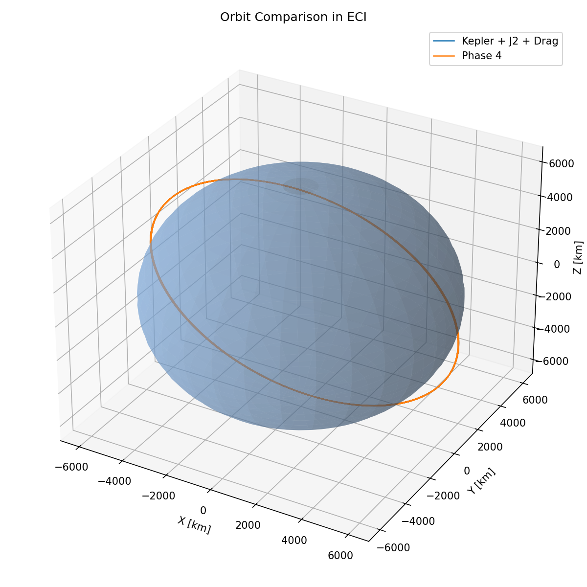
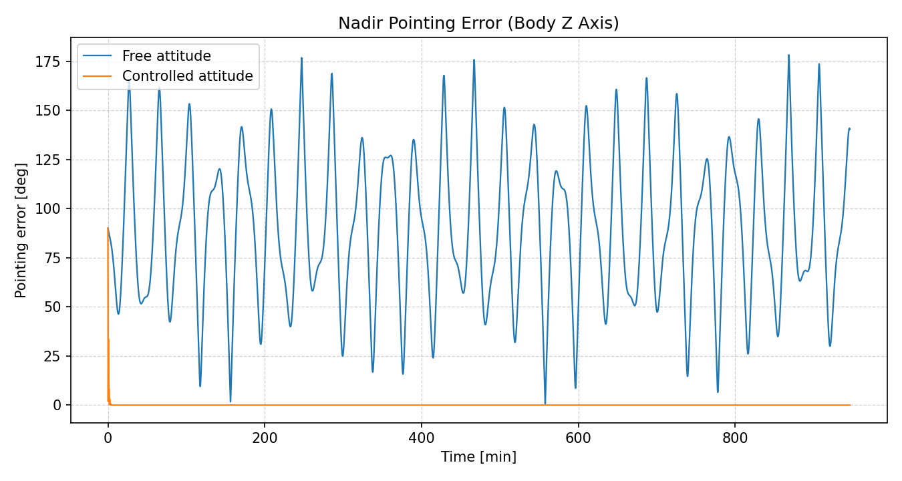
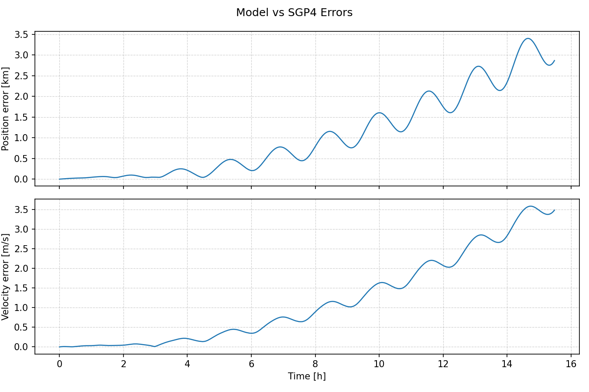

# OrbitLab Mission Simulator


Modular astrodynamics simulator for orbital and attitude dynamics in LEO, built with an engineering-first workflow: model, validate, compare, and document.

## Project Snapshot
- Current implementation status: phases `0-7` completed.
- Main scenario: CubeSat 3U at 500 km, near-circular SSO-like orbit (`i = 97 deg`).
- Main capability: end-to-end pipeline with orbit propagation, attitude dynamics/control, and TLE/SGP4 external validation.

## What This Simulator Includes
- Translational dynamics:
  - two-body gravity,
  - J2 perturbation,
  - atmospheric drag (layered exponential model + co-rotating atmosphere),
  - Sun/Moon third-body perturbations,
  - SRP with cylindrical eclipse switch.
- Attitude dynamics and control:
  - quaternion kinematics,
  - rigid-body rotational dynamics,
  - gravity-gradient torque,
  - LVLH/nadir reference,
  - quaternion PD controller,
  - reaction wheel torque saturation.
- External validation:
  - TLE parsing,
  - SGP4 reference propagation,
  - model-vs-SGP4 error metrics (norm + RTN decomposition).

## Key Results (Current Baseline)
From the latest documented phase-7 run:

- TLE/SGP4 validation (ISS sample, ~15.483 h):
  - RMS position error: `1.445595 km`
  - Max position error: `3.401309 km`
  - RMS velocity error: `1.622539 m/s`
  - Max RTN errors:
    - Radial: `0.293110 km`
    - Along-track: `3.401235 km`
    - Cross-track: `0.084696 km`
- Attitude control (phase 6):
  - Mean nadir error (free): `89.882869 deg`
  - Mean nadir error (controlled): `0.056668 deg`
  - Final nadir error (controlled): `0.000001 deg`
  - Reaction wheel saturation events: `0.000 %` (baseline case)

## Visual Evidence




## Repository Structure
```text
satellite_simulator/
|-- main.py
|-- constants.py
|-- orbit/
|   |-- propagator.py
|   |-- kepler.py
|   |-- perturbations.py
|   |-- frames.py
|   `-- tle_validation.py
|-- attitude/
|   |-- quaternion.py
|   |-- rigid_body.py
|   |-- controller.py
|   `-- actuators.py
|-- environment/
|   |-- atmosphere.py
|   |-- sun.py
|   |-- moon.py
|   |-- magnetic_field.py
|   `-- time_utils.py
|-- visualization/
|   `-- plots.py
`-- data/
    `-- tle/
```

## Tech Stack
- Python
- numpy
- scipy
- matplotlib
- sgp4

## Quickstart
### 1) Install dependencies
```bash
python -m pip install -r requirements.txt
```

### 2) Run full pipeline (phase 7 entrypoint)
```bash
python main.py
```

### 3) Run with a specific TLE
```bash
python main.py --tle-file satellite_simulator/data/tle/iss_sample.tle
```

Alternative entrypoint:
```bash
python -m satellite_simulator.main
```

## Generated Outputs
The run generates figures in `outputs/`, including:
- `orbit_3d_j2_drag_vs_phase4.png`
- `altitude_j2_drag_vs_phase4.png`
- `raan_j2_drag_vs_phase4.png`
- `perturbations_phase4.png`
- `attitude_quaternion_components_controlled.png`
- `attitude_body_rates_controlled.png`
- `attitude_gravity_gradient_torque.png`
- `attitude_pointing_error_comparison.png`
- `attitude_control_torque_comparison.png`
- `tle_position_velocity_error.png`
- `tle_rtn_errors.png`
- `invariants_kepler.png`

## Current Limitations
- Frame rigor in SGP4 comparison:
  - SGP4 states are TEME; current comparison is ECI-like and should be upgraded with explicit TEME -> ECI handling.
- Ephemerides fidelity:
  - Sun/Moon models are analytic approximations (not SPICE/JPL high-fidelity ephemerides).
- TLE source:
  - validation currently uses local sample TLE files (no live fetch pipeline).
- Code organization:
  - `satellite_simulator/main.py` is still large and should be split into smaller pipeline modules.

## Why This Project Is Strong for Portfolio
- It demonstrates real astrodynamics workflow, not only visualization.
- It includes progressive physics layering and model comparison.
- It includes ADCS control with actuator constraints.
- It includes external validation against TLE/SGP4.
- It keeps technical traceability via memory and logbook documents.

## Documentation
- Current handoff/state: `docs/current_state.md`
- Full technical memory: `docs/MEMORIA_PROYECTO.md`
- Chronological logbook: `docs/BITACORA_PROYECTO.md`
- New-phase template: `docs/PLANTILLA_REGISTRO_FASE.md`

